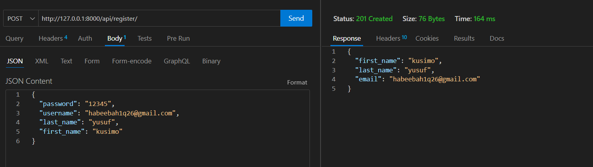
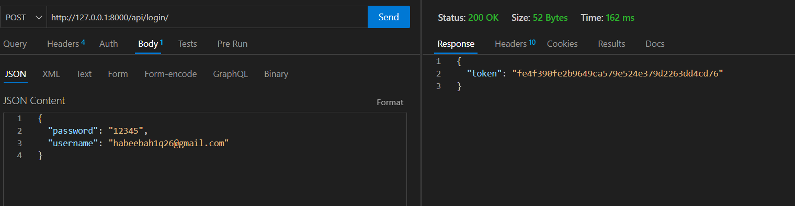
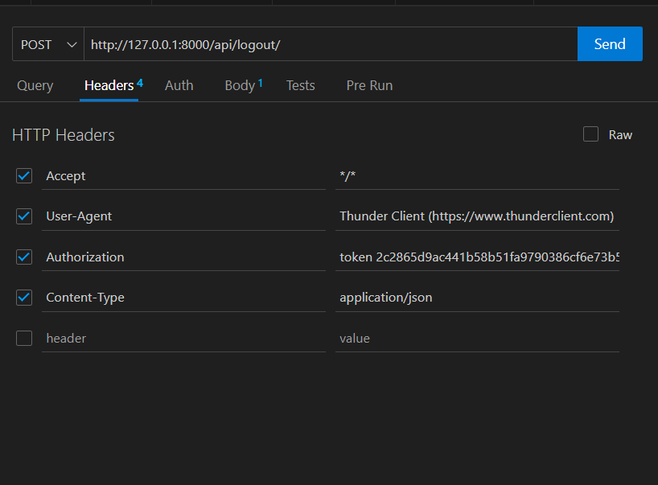
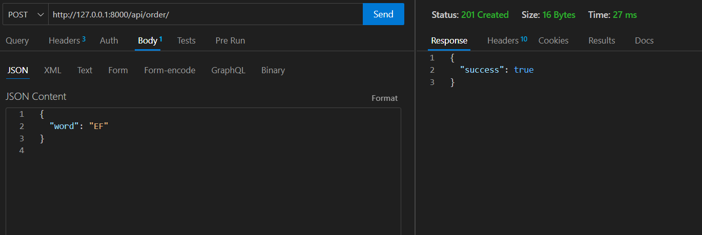
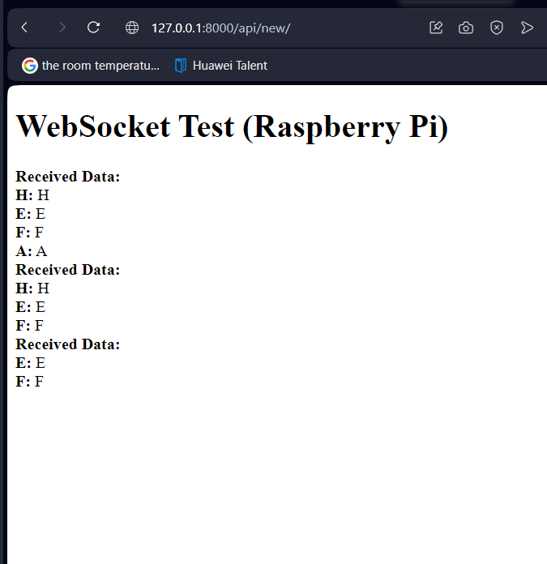

# LETTERS

Select Random 4 letters and place an order

## Table of Contents

- [Installation](#installation)
- [Usage](#usage)
- [API Endpoint](#api-endpoint)

## Installation

To get started with the project, follow these steps:

1. ## Enter the Root folder directory of the project ;'project/'

2. ## Create a virtual environment (optional but recommended):
    ```python -m venv venv```
    ```source venv/bin/activate  # On Windows, use: venv\Scripts\activate```

3. ## Install project dependencies from the requirements.txt file:
    ```pip install -r requirements.txt```

3. ## Database migrations:
    ```python manage.py migrate```

4. ## Start the development server:
    ```python manage.py runserver```


## API Endpoints

### Base URL = http://127.0.0.1:8000/api

1. #### Register a New User
    ##### Method: POST
    ##### Endpoint: /register/
    - ##### Payload: JSON object with the following fields:
        . password: Users password
        . first_name: User's first name
        . last_name: User's last name
        . username: User's email address
    - ##### Header: 
        . Content-Type: application/json

    #### Example
    ```{"password": "12345", "username": "yusuf12@gmail.com", "last_name": "yusuf", "first_name": "kusimo"}```

    

2. #### Log in a User
    ##### Method: POST
    ##### Endpoint: /login/
    - ##### Payload: JSON object with the following fields:
        . username: User's email address
        . password: Users password

    - ##### Header: 
        . Content-Type: application/json

    #### Example BODY of request:
    ```{"password": "12345", "username": "yusuf12@gmail.com"}```

    

3. #### Log out a User From Session
    ##### Method: POST
    ##### Endpoint: /logout/
    - ##### Header: 
        . Content-Type: application/json
        . Authorization: token "2c2865d9ac441b58b51fa9790386cf6e73b54784"

    


4. #### View order history:
    ##### Method: POST
    ##### Endpoint: /order/
    - ##### Payload: JSON object with the following fields:
        . word: the selected 4 letters
    - ##### Header: 
        . Content-Type: application/json
        . Authorization: token "2c2865d9ac441b58b51fa9790386cf6e73b54784"

    #### Example BODY of request:
    ```{"word": "ABCD"}```

    


5. #### Raspberry Pi Websocket API:
    ##### Enpoint: 'ws://127.0.0.1:8000/ws/raspberry_pi/'

    ### For Testing:
    1. Naviage to the Endpoint: http://127.0.0.1:8000/api/new/
    2. Make and Order, You wil see the order you make will be display to the above Url( http://127.0.0.1:8000/api/new/)

    


6. #### Run these command when ever you delete the database
    ```python3 manage.py migrate --run-syncdb```
